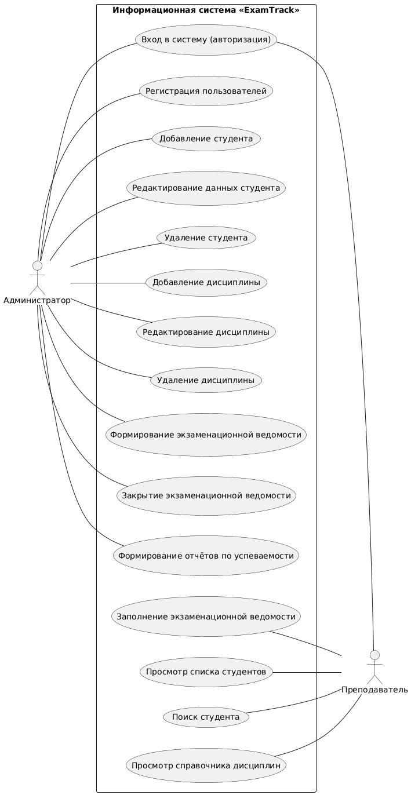

# ExamTrack
## О проекте

Проект представляет собой консольное приложение для контроля успеваемости обучающихся и учёта результатов их промежуточной аттестации(«ExamTrack»). Система предназначена для автоматизации учёта успеваемости, оперативного контроля сдачи сессий, мониторинга академических задолженностей и поддержания целостности и достоверности данных об учебном процессе. 

## Принцип работы системы

Программа построена по трёхуровневой архитектуре:
1. **Слой пользовательского интерфейса** (`ExamTrack/src/main.py`) — обеспечивает отображение электронных ведомостей, списков студентов, каталога дисциплин, карточек успеваемости и системных уведомлений
2. **Слой бизнес-логики** — выполняет логическую валидацию данных: контроль допустимости выставления оценок, проверка прав текущей роли на оценивание конкретной группы, расчёт академических рейтингов и среднего балла.
3. **Слой данных** — хранит персистентную информацию и управление записями.

В системе предусмотрено разграничение прав по ролям:
- **Администратор (Сотрудник деканата / Учебного отдела)** — выполняет операции добавления, корректировки и удаления сведений об учебных группах, студентах и дисциплинах учебного плана.
- **Преподаватель (Экзаменатор / Пользователь системы)** — осуществляет заполнение открытых экзаменационных ведомостей (выставление оценок, баллов, отметок о неявке), просматривает историю сдачи экзаменов студентами по своей дисциплине.


## Моделирование системы (Use Case)

Для наглядного представления функционала системы и разграничения доступа построена диаграмма вариантов использования (Use Case).




Ключевые особенности модели:
- Взаимодействие разделено между двумя акторами: **Администратор** и **Преподаватель**.
- Отношение между актором *«Администратор»* и актором *«Преподаватель»* определено как **`обобщение`** (наследование), так как администратор наделен всеми базовыми правами преподавателя, но при этом имеет свои дополнительные функции по управлению системой.
- Стрелка отношения `наследования` направлена от актора-наследника (Администратор) к базовому актору (Преподаватель).
- Исходный код диаграммы на языке PlantUML находится в файле: [`docs/UseCase.plantuml`](docs/UseCase.plantuml).

## Структура проекта

```text
ExamTrack/
│
├── docs/                       # Проектная документация и модели
│   ├── UseCase.plantuml        # Диаграмма вариантов использования на языке PlantUML
│   └── UseCase.png             # Изображение Use Case диаграммы
│
├── ExamTrack/src               # Исходный код приложения
│   │
│   └── src/                    # Основной пакет приложения
│       ├── __init__.py         # Инициализация пакета Python
│       └── main.py             # Точка входа в приложение
│
├── tests/                      # Автоматизированные тесты
│   ├── __init__.py             # Инициализация пакета тестов
│   └── test_main.py            # Модульные тесты приложения
│
├── .gitignore                  # Файл исключений для системы контроля версий Git
├── README.md                   # Основная документация проекта
└── requirements.txt            # Список внешних зависимостей проекта
```

## Что нужно для запуска?

- [Git](https://git-scm.com/downloads)
- [Python>=3.10](https://www.python.org/downloads/)

## Запуск проекта

1. Клонирование репозитория с github
```bash
git clone https://github.com/mari7infp/ExamTrack.git
```

2. Переход в корень проекта
```bash
cd ExamTrack
```

3. Создание виртуального окружения
- **Windows**
```bash
python -m venv venv
```
- **Linux/macOS**
```bash
python3 -m venv venv
```

4. Активация виртуального окружения
- **Windows**
```bash
venv\Scripts\activate
```
- **Linux/macOS**
```bash
source venv/bin/activate
```

5. Установка зависимостей
```bash
pip install -r requirements.txt
```

6. Запуск работы
- **Windows**
```bash
python src/ExamTrack/main.py
```
- **Linux/macOS**
```bash
python3 src/ExamTrack/main.py
```

После запуска программа выведет:
```text
hello world
```

## Тестирование

Для запуска автоматических модульных тестов выполните команду:
- **Windows**
```bash
python -m unittest discover -s tests
```
- **Linux/macOS**
```bash
python3 -m unittest discover -s tests
```
